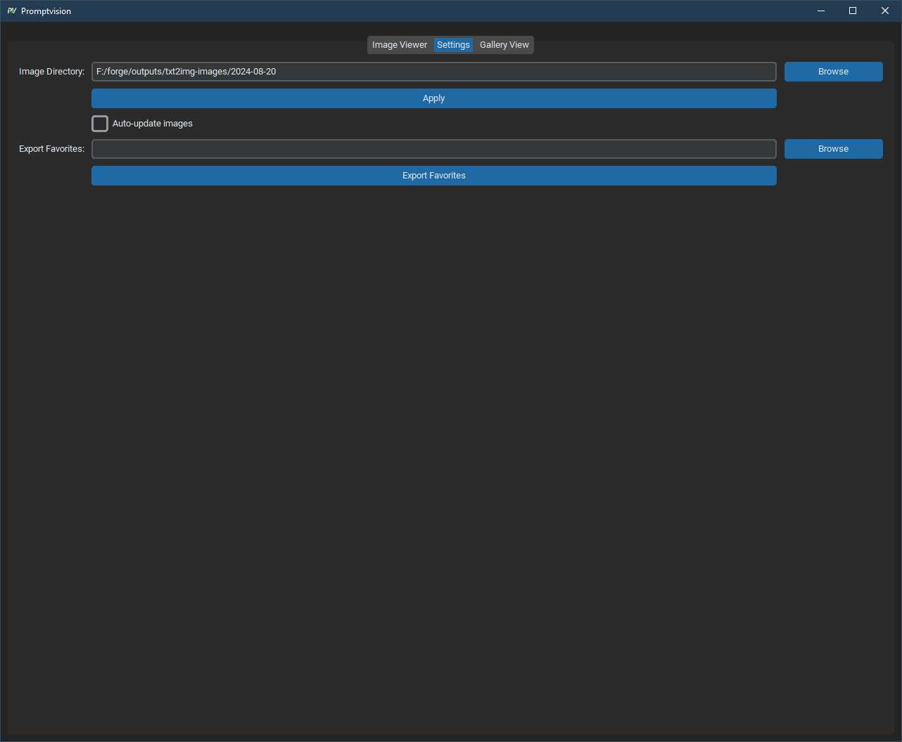

# Promptvision

Promptvision is a powerful and user-friendly image viewer application built with Python and customtkinter. It provides an intuitive interface for browsing, organizing, and managing your image collections.

## Features

- Image browsing with next/previous navigation
- Metadata generation display for each image
    - Supporting automatic1111 and forge
- Gallery view for quick image overview
- Favorite image marking and exporting
- Auto-update feature for monitoring new images in the selected directory
- Settings management for persistent user preferences
- Keyboard shortcuts for efficient navigation

## Installation

1. Clone the repository:
``` 
   git clone https://github.com/yourusername/promptvision.git
   cd promptvision
```

2. Install the required dependencies:
   
```
   pip install -r requirements.txt
```
   

3. For Linux users, install tkinter:

    On Ubuntu or Debian-based systems:
    ```
    sudo apt-get install python3-tk
    ```
    On Fedora or Red Hat-based systems:
    ```
    sudo dnf install python3-tkinter
    ```
    On Arch Linux:
    ```
    sudo pacman -S tk
    ```

## Usage

To run Promptvision, execute the following command in the project directory:


```
    python promptvision.py
```


## Key Bindings

- Left Arrow / 'A': Previous image
- Right Arrow / 'D': Next image
- 'F': Toggle favorite status of the current image

## Image viewer


(WSL2 on Windows 10)

## Settings

Customize your Promptvision experience with the settings panel:



## Gallery Fullscreen


(WSL2 on Windows 10)


## Contributing

Contributions are welcome! Please feel free to submit a Pull Request.

1. Fork the repository
2. Create your feature branch (`git checkout -b feature/AmazingFeature`)
3. Commit your changes (`git commit -m 'Add some AmazingFeature'`)
4. Push to the branch (`git push origin feature/AmazingFeature`)
5. Open a Pull Request

## License

This project is licensed under the MIT License - see the LICENSE file for details.